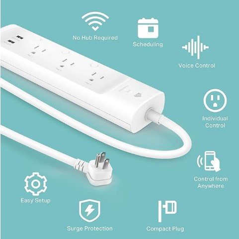

## Introduction
1. What is your group trying to accomplish? 
> Our group is trying to create an innovative home solution using sensors to make everyday life easier for our target customers.
2. Who are your target users?
> Our target users is anybody who prioritizes making their home more comfortable and convenient. These include:
* People single or married, of any age range, and of any level of physical disability, renting or owning the current space they live in, with access to electricity.
* Children of people renting or owning said space.

## Voice of customer benchmarking

## Search #1
**Keywords:** "home automation" 
**Search result link**: https://www.amazon.com/s?k=home+automation&crid=28YP1ZDUDCWNI&sprefix=home+automation%2Caps%2C307  
**1. Selected Product**: [Kasa Smart Plug Power Strip KP303](https://www.amazon.com/Kasa-Smart-Protector-Required-KP303/dp/B083JKSSR5?ie=UTF8)

 
**Figure 1** Kasa Smart Protector

Price: $30

Vendor: Amazon

Description: Smart surge protector with three independently controlled outlets and two USB ports. The surge protector comes with Alexa and Google assistant integration, and comes with app control compatible with iOS and Android devices and is ETL certified.

**Negative Comments**
| Voice of customer | Restated Customer Need |
|-------------------------------------------------------------------------------------------------------------------------------------------------------------------------------------------------------------------|-------------------------------------------------------------------------------------|
|"...still wish it was cheaper I wish the cord was longer though and it was a flat head plug"                                                                                                                       | 1. Product should be affordable (explicit) 2. Plug shape should be convenient (explicit).                                |
|"First time using something "smart", decently easy to set up. Had to trouble shoot a few times but I got it. The only issue i have is the USB ports dont apply to the wifi controls of the power strip."           | 1. "Smart" shouldn't mean confusing (latent)  2. User shouldn't run into a whole lot of troubleshooting (latent). 3. All ports should be able to be individually controlled (explicit).
|"Product works great…. However. It is some what deceiving that this 3 outlet plug does NOT have the same features as the 5 outlet (HS300 plug). I need to have energy monitoring (wattage). The 3 outlet plug just tells you the ‘run time’ measured in hours which doesn’t really do anything. Otherwise, this smaller surge protector is seamless and works as advertised. I just need to return it and buy the more expensive one to meet my needs. I wish they were more clear with the product description."|1. Advertising should be clear (explicit).   2. Should show power usage not just "run time"(explicit).   3. The device should be as feature rich as a more expensive or larger sized product (latent).

**Positive Comments**
| Voice of customer | Restated Customer Need |
|---------------------------------------------------------------------------------------------------------------------------------------------------------|----------------------------------------------------------------------------------------------------------------------------------------------------------------------------------------------------------------|
|"I got this because the app is user friendly, easy to set up & it was easy to connect to my Alexa and works well"                                        |1. Device interface should be user friendly (explicit)  2. It should not be a headache to setup(explicit)   3. Easy to connect(explicit).  4. Product should interface well with existing smart home devices (latent).|
|"I recommend getting the strip versus the individual plugs because it's more economical and always better to have more outlets than less."               |1. Product should have as many plugs as is reasonable to include (explicit)  2. One smart system should control as many plugs as possible (latent).                                                          |
|"I used it in an automated Halloween setup to control lighting of various scenes via a BAT script running on a PC via the Kasa Command Line interface..."|1. Product should allow manual control via a PC running a script and not rely on the smartphone app for automation (latent).                                                                                    |

## Search #2
**Keywords:** "smart power strip energy monitoring"  
**Search result link**: https://www.amazon.com/s?k=smart+power+strip+energy+monitoring&crid=1HTJ1BNZKTC8E&sprefix=smart+power+strip+energy+monitoring%2Caps%2C379&ref=nb_sb_noss_1  
**2. Selected Product**: [Emporia Energy Monitoring Smart Plug EMSO1-4](https://a.co/d/4s87wz8)

 
**Figure 2** Emporia Smart Outlet

Price: $35

Vendor: Amazon

Description: App controlled smart outlet with enertgy monitoring. 2.4GHz and 5GHz wireless compatible.  The power outlet comes with Alexa and Google Home integration. Android and iOS devices and is ETL certified. Ten amp max continuous load and fifteen amp peak load for one hour per day.

## Positive Comments
| Voice of customer | Restated Customer Need |
|-------------------------------------------------------------------------------------------------------------------------------------------------------------------------------------------------------------------|-------------------------------------------------------------------------------------|
|"I now own eight of these. I'm monitoring my PC, the sum of the PC and cable modem and wireless router and etc., a Raspberry Pi that does some neat things, a home air filter, the furnace (10 watts 24 hours a day, whether heating or not crazy!), the clothes washer, the refrigerator, and an audio power amp used only when watching movies. It's informative to learn how much electricity these devices use, and find ways to optimize the usage. Plus, I love real-time graphs of data. Whee!"  | 1. Energy monitoring af multiple appliances is important (explicit).   2. Data driven graphics for easy to understand visuals (latent).   3. Energy consumption education is a helpful skill (latent).
|"I love my emporia meter and circuit monitoring system and this lets me have even finer detail. I plugged fridges into them so i can see how much they use in a day. NOTE: you cant use for devices that use 1200+ watts for more than an hour a day, otherwise its safety feature will shut it off. Emporia, please make a heavy duty one. I'd love to be able to plug in my Midea 12k BTU U-shape window AC, but it shuts down if it needs to cool a lot and run its compressor at 100% | 1. The outlet provides detailed energy monitoring (explicit).   2. Outlet needs a higher amperage rating of 15 amps or more (latent).   3. Outlet is desired for high amp applications such as running an AC unit (explicit).
|"They say the "outlets" only use one receptacle, that is because the outlets are made to install one per 2 receptacle. This way it will not cover up more than one spot. However, if you install one in a 4 receptacle spot you will lose two spots, not a biggie. I installed the App and the electrical panel (called the Emporia Vue) unit first and then wanted to look at usage on a finer level so I installed some individual monitors. They were very easy to install (just plug them in) and attaching them to the app was easy. It did take a little time for the outlet to update the software but that is pretty common (several minutes). The bar chart is showing the outlet monitoring my surveillance system, which is 24/7. You can see that it is costing me about .42 cents in March so far to run the system. The next picture from the app shows I have 5 plugs installed so far. I am happy with them although I would like to see some improvements in the app to customize it for my specific needs[...]."|1. Large outlet format impedes adyacent outlets (latent).   2. App is user friendly (explicit).   3. Data should be visually represented and easy to read (latent).

## Negative Comments
| Voice of customer | Restated Customer Need |
|-------------------------------------------------------------------------------------------------------------------------------------------------------------------------------------------------------------------|-------------------------------------------------------------------------------------|
|"Bought a set of 2 and could only get one to connect. Extremely hard to make initial connectivity with the plug. Could only connect to 2.4 ghz and had to shut down the 5 ghz signal just to connect. Very limited on amperage levels with guide saying no more than 10. Found them to be too impractical and returned them."| 1. Difficult connectivity setup (explcit).   2. Compatibility with home networks (latent).   3. Low amperage rating (explicit).
|"I'm no longer using most of these plugs any more. They began dropping the 'line' randomly, meaning, the relay inside would switch from on to off then on in about a half second. While I have these generally on non-critical devices, I also monitored two Uninterruptible Power Supplies (UPS), and that little blip on/off/on would cause the UPS to go from A/C to battery backup to A/C in the same time - just not good for them, or for me hearing them alarm because of it. And for other devices, even non-critical, having the power interrupt in a split second just adds wear and tear.   I contacted support, the first time it happened they sent me a replacement, which then did the same thing. It may be a wifi issue, but even a wifi issue shouldn't cause the device to interrupt power - it should simply retry connecting to the wifi in the same state it's been in. | 1. Device needs to be reliable (latent).   2. Redundancy when network is disabled(latent).    3. Device needs to support high amp appliances (explicit).
|"I have about a dozen of these installed at my house to either control or monitor electrical circuits. I have two big problems with these devices:

1. I had one fail shortly after install that was connected to a basement freezer. This device just failed, and the freezer did not have power for two days until I noticed it. Unfortunately, I had to throw away a few hundred dollars worth of food stored in that freezer.
2. They clearly state it now, but the didn't when I purchased these devices, but they are only 15 amps for 1 hour and then they shut down. I have an old house and have a few portable electric heaters plugged into these devices so I can turn on heat in the kitchen and bathroom on a schedule so it is warming up by the time I get out of bed. Unfortunately, these devices don't work well in that scenario, unless I want to switch all of the heaters to low power, which kinds of defeats the purpose of warming those spaces up quickly. They should stop the false advertising and just list these as 10 am devices. | 1. Notification to user is needed when power fails(latent).   2. Power management of multiple devices(explicit).   3. Higher continuous draw support (explicit).

## Search #3
>**Keywords:** "smart plug power strip programmable"  
**Search result link**: https://www.amazon.com/s?k=smart+plug+power+strip+programmable&crid=4ZAZMKROGOZ6&sprefix=smart+plug+power+strip+programmable%2Caps%2C389   
**3 Selected Product**: [HBN Outdoor Smart Plug](https://www.amazon.com/HBN-Outdoor-Waterproof-Compatible-Assistant/dp/B0C65K1S8V?crid=4ZAZMKROGOZ6&dib=eyJ2IjoiMSJ9.bueRwh-e_4xF94EssdD04F5lZGyeykhWeEtDije3gqPGjHj071QN20LucGBJIEps.6xwVN6Npg1i8Kg0wqsf-YVJ1MgLRNIQCJcRUpMtr2tM&dib_tag=se&keywords=smart%2Bplug%2Bpower%2Bstrip%2Bprogrammable&qid=1757876364&sprefix=smart%2Bplug%2Bpower%2Bstrip%2Bprogrammable%2Caps%2C389&sr=8-19&xpid=IiIRdXITkfjd4&th=1)  
Price: $24.64  
Vendor: Amazon  
Description: This smart outdoor plug features six grounded outlets with overload protection, a 6-foot extension cord, and a weather-resistant stake design for reliable use in rain, snow, and wind. Compatible with Alexa, Google Assistant, and the Smart Life/TUYA apps, it allows for convenient voice control, scheduling, and timer settings to easily manage holiday lights, garden décor, or other outdoor appliances. Simple to set up on a 2.4GHz Wi-Fi network, it offers hands-free control and collective power management, making it ideal for patios, backyards, landscaping, or seasonal decorations.

  
**Figure 3** HBN Outdoor Smart Plug

**Positive Comments**
| Voice of customer | Restated Customer Need |
|-----------------------------------------------------------------------------------------------------------------------------------------------------------------------------------------------------------------------------------------------------------------------------------------------------------------------------------------------------------------------------------|-----------------------------------------------------------------------------------------------------------------------------------------------------------------------------------------------------|
|"Nice outside waterproof wifi enabled extension cord outlets. You can put in the ground easily and has been reliable."                                                                                                                                                                                                                                                             |1. Product should be resistant to elements (explicit).  2. Wifi connectivity (explicit).  3. Easily anchored outside (explicit).  4. Must be durable (explicit).                            
|"Very pleased with this item. So pleased I bought a second one for the backyard. Easily put together. Very sturdy. Easily programmed. What I like most are the spring mechanisms on the plug covers and the cover on top where programming takes place."                                                                                                                           |1. Product should be able to be assembled easily, if assembly is required (explicit).   2. Weather resistant features should be sturdy and somewhat automatic, as in the spring covers (explicit).
|"It comes with a heavy weight outdoor 6 foot power cord and a rugged yard stake for stable placement. A small remote control and the battery is Included - (nice touch). There are several different time modes from 2 to 8 hours on after dusk. It can also be set to run from dusk to dawn. It has a photocell sensor so that it will run the Christmas lights until after dusk."|1. Power elements should be durable and far reaching (explicit).   2. Controls besides wifi should be available for simple functions such as power on a timer and photocell sensing (explicit).   

**Negative Comments**
| Voice of customer                                                                                                                                                                                                                                                                                                                                    | Restated Customer Need                                                                                                                                                                                                                                       |
|------------------------------------------------------------------------------------------------------------------------------------------------------------------------------------------------------------------------------------------------------------------------------------------------------------------------------------------------------|--------------------------------------------------------------------------------------------------------------------------------------------------------------------------------------------------------------------------------------------------------------|
|"Getting it setup was a bit of a challenge as the included instructions were worthless."                                                                                                                                                                                                                                                              |1. Setup should not be challenging (explicit).   2. Product should not rely on a set of instructions (latent).                                                                                                                                             |
|"Even when full on dark, you have to wait another 25 to 30 minutes before your lights come on."                                                                                                                                                                                                                                                       |1. Sensors should be accurate enough to sense when the desired conditions are met to power on and off (explicit).  2. User should be able to edit desired conditions at which elements power on or off, whether it be lighting, temperature, etc. (latent).|
|"As long as the covers are all closed, I suppose it is waterproof. Of course, if you open one of the covers to plug something into it, now that plug is no longer covered and is no longer protected from the elements. The other issue I have is that the outlets are not controllable separately It's either everything is on or everything is off."|1. If product is to be weather resistant then it should be resistant in all stages of usage (explicit).   2. The product should offer more customizability than a binary on and off for all outlets (explicit).                                            |

## Search #4
**Keywords:** "energy saving smart" 
**Search result link**: https://www.google.com/search?q=energy+saving+smart+power+strip&rlz=1C1GCEA_enUS878US878&oq=energy+saving+smart+power&gs_lcrp=EgZjaHJvbWUqCAgBEAAYFhgeMgYIABBFGDkyCAgBEAAYFhgeMggIAhAAGBYYHjIICAMQABgWGB4yCAgEEAAYFhgeMg0IBRAAGIYDGIAEGIoFMg0IBhAAGIYDGIAEGIoFMg0IBxAAGIYDGIAEGIoFMgoICBAAGIAEGKIE0gEJMTA0NTVqMGo3qAIAsAIA&sourceid=chrome&ie=UTF-8#oshopproduct=gid:1373486050393941307,mid:576462771857904130,oid:11989638684473196982,iid:14029040634763611425,rds:UENfMTM3MzQ4NjA1MDM5Mzk0MTMwN3xQUk9EX1BDXzEzNzM0ODYwNTAzOTM5NDEzMDc%3D,pvt:hg,pvo:3,laoid:1&oshop=apv&pvs=0   
**4. Selected Product**: [Feit Electric Feit Smart 4 -Outlet 460 Joules 1875 -Watts White Indoor Various receptacles Surge Protector](https://www.lowes.com/pd/Feit-Electric-Feit-Smart-Surge-with-USB/5000875091?user=shopping&feed=yes&srsltid=AfmBOoq1J78UncASz3TyYHx9qXWjRuB4Pqgw6Zkq0Xy9Rtk2mK1S2-3YMks)

Price: $49

Vendor: Lowes Home Improvement

Description: Four USB ports and four power outlets that are WiFi enabled via a smartphone app. It has Google Assistant, Alexa, and Siri integration. Controllable with voice commands. For indoor appliance use, supports up to 15 amps.

## Positive Comments
| Voice of customer | Restated Customer Need |
|-------------------------------------------------------------------------------------------------------------------------------------------------------------------------------------------------------------------|-------------------------------------------------------------------------------------|
|"This outlet has a lot of potential though the design is not the best. I really like the idea of a smart outlet, especially one which has 4 USB ports, which is critical in the smart phone era. The outlet itself works well - it was easy to set up the smart connectivity (through the app, which is also designed well), and the features through the app are easy to use (turn off certain outlets, timing, etc.). It also syncs with Echo, though it doesn't always work great tbh (the fault is actually on Echo's side to be honest, as the software is not always smart to differentiate between the outlet and other smart devices in the same room). The 3 star review is for the design of the traditional outlets - they are spaced too close to each other! Too many devices today require some kind of a bulky adaptor (including the aforementioned Echos), and unfortunately, once you plug one of those in, you basically have only one space left for anything else. So if you're going to use it close to your bed or a working desk, you should be ok. But it's certainly not optimal for a media unit (with routers, modems, TVs, etc. where a surge-protected power-strip might be a better choice)."  | 1. Needs to have USB ports (explicit).   2. User friendly app (latent).   3. Outlets need to be well spaced (explicit).
|"This smart power strip turned out to be a great alternative to in-wall smart switches and smart plugs because it can control each of the 4 outlets plus the USB cluster individually, all in one unit. So I can plug in a lamp, a humidifier and anything else that can stay in the ON position and turn them on or off in the app. The cool part is that it functions the same way through the Feit Electric app as it does in the Alexa app once I linked them. I renamed the outlets and can now turn the lamp on just by asking Alexa to do it. I can also turn off the whole power strip the same way. The Feit app is also easy to set up and use so I had everything up and running in just minutes. The blue LEDs show me which outlet is on at a glance, so there's no guessing when using Alexa. The power strip isn't all that larger than a non-smart power strip either, so it's easy to tuck away."| 1. Individual control of each outlet is desired (latent).   2. Voice assistant compatibility (explicit).   3. LED light to indicate which outlet is turned on(latent).
|"This is a cool WiFi power strip, it has all the advantages of a power strip such as circuit protection and a on/off switch, not to mention the ability to plug in 4 outlet and 4 USB items at once. But you also get the advantages of a smart plug or outlet by way of the free app called Feit Electric. The setup is easy and adding or deleting a plugged in item is straightforward. Once you have an item setup on the power strip you can control the on/off state and setup timers to turn the item off and on when needed. You can also setup Alexa or Google so that you can control the power strip items via voice command. I have yet to try it but you should be able to integrate this power strip with other smart home items such as turning the strip off when you leave home and on when you return."|1. Circuit protection (explicit).   2. Physical buttons for power activation(explicit).   3. Timer functionality (explicit).

## Negative Comments
| Voice of customer | Restated Customer Need |
|-------------------------------------------------------------------------------------------------------------------------------------------------------------------------------------------------------------------|-------------------------------------------------------------------------------------|
|"The smartplug works fine. The only features is wifi on/off and scheduled on/off (e.g. on at 6pm and off at 10pm). Unfortunately, the app does NOT have more advance features - e.g. If you turn a device on, you want it to automatically turn off in 10 mins. (e.g. you forget to turn off your light). Or to have it on "all the time" and to turn off for only 10 mins and automatically on after 10 mins - (e.g. Pumps in an Aquarium during feeding). Other smart plugs have such features. I just wished they incorporated these features. Maybe the company need to hire more creative app designers."| 1. Needs controls for simple functions (explcit).   2. Advanced control features are desired (explicit).   3. Temporary off and on (explicit).
|"I ordered three of these because I had (and still have) such great experiences with Feit's smart bulbs. Unfortunately, I cannot say the same for their smart plugs. Two out of the three would not complete pairing or would pair then stop working if I tried to move them to a different outlet. While the pairing process is not difficult, per se, I experienced many, many failures in trying to pair all three of them...whether in Auto or AP mode. This past Sunday was the last straw. I tried for two hours to pair both of the two in different outlets and different rooms. They would *occasionally* pair, but then the WiFi radio would disconnect and stop working. Most of the time, they wouldn't even pair.   I'm giving this two stars because one of them (finally) did pair and so far has stayed paired. But I'm afraid to move it because I think it will crap out on me again. I ended up a buying a 4-pack of "another brand" at Lowes for $20, and they work *flawlessly* (so far).   I highly recommend their smart bulbs, but I would steer clear of these unless you want to roll the dice and take a chance and them not working.. | 1. Reliable pairing process (explicit).   2. Stable connectivity (explicit).    3. Ease of setup accross devices and locations (latent).
|"Pros: Purchased this because it shares the same Feit app as the several in-wall hard-wired dimmer switches I have in the house. Easy setup and convenient when it does work, even has a on/off switch for manual operation.   Cons: Not reliable, once every few weeks this device will go offline requiring unplugging and reconnecting to reboot. I have concerns about turning lighting or device on/off from overseas while on vacation. I'm sure there are more reliable brands out there, but again, I kept this just because I have other devices using the Feit app.  Overall: Good value if you don't mind the occasional offline and reset, even with the router 2 feet away. | 1. Consistent reliability(explicit).   2. Trustworthy remote access(explicit).   3. Cross device ecosystem compatibiltiy(latent).

## Search #5
**Keywords:** "remote controlled power strip" 
**Search result link**: https://www.google.com/search?sca_esv=cdd4458fa27f824d&rlz=1C1GCPG_enUS1169US1169&udm=28&fbs=AIIjpHxU7SXXniUZfeShr2fp4giZjSkgYzz5-5RrRWAIniWd7tzPwkE1KJWcRvaH01D-XIX002E0qNXsgfZ6fffiMQMigVxnU6tfQmfH9K5I6DpRZ0bZHP7J9wZhgZxLhz_VHUjP3FUfq8aIQ89-q-WX4tdwHbYSXtQ5Wzr0LQX3-uevbkvkHtjr2tuVBsQmiMlabeztv_zfWGzDInTmpt5ePpR0cLdBIA&q=remote+controlled+power+strip&ved=1t:220175&ictx=111&biw=1536&bih=774&dpr=1.25#oshopproduct=cid:10950339184001827565,oid:13861711271772027795,iid:3510986934337953009,rds:Q0lEXzEwOTUwMzM5MTg0MDAxODI3NTY1fFBST0RfQ0lEXzEwOTUwMzM5MTg0MDAxODI3NTY1,pvt:hg,pvo:19&oshop=apv&pvs=0   
**5. Selected Product**: [15-Amp Outdoor Plug-In Photocell Light Sensor 6-Outlet Yard Stake Timer](https://www.homedepot.com/p/Woods-15-Amp-Outdoor-Plug-In-Photocell-Light-Sensor-6-Outlet-Yard-Stake-Timer-with-6-ft-Cord-Green-13547WD/203638967)

Price: $15.35

Vendor: Home Depot

Description: The Outdoor Grounded 6-Outlet Yard Stake with built in timer turns outdoor lights on and off at set times. The photoelectric eye senses the absence of daylight and automatically turns your lights on and then off after a set amount of hours, or off at dawn according to the schedule you manually set. The light sensor timer has 7 options that repeat daily, on at dusk off at dawn, on at dusk and off after 2, 4, 6, or 8 hours, always on, or always off.

## Positive Comments
| Voice of customer | Restated Customer Need |
|-------------------------------------------------------------------------------------------------------------------------------------------------------------------------------------------------------------------|-------------------------------------------------------------------------------------|
|"Excellent outdoor light sensor/timer! We've been using one for years, and finally got another to go along with it. The timing part is great, as its presets are pretty much exactly what we want: after it gets dark, how many hours to leave the power going. Of course, we use this for Christmas lights and, on occasion, some festive summer lights. Our original one has been through several years of Pacific NW weather - that is, rain, lots of drizzly rain. And that exposes the biggest downside to this - the cover over the top of the dial gets fogged up easily, so you can't see the insides very well. (It probably also interferes at least a little bit with the light sensing, but not enough for us to take notice.) All in all, this outdoor plus has served us well - so well, in fact, that we recently got another. The original still works great, but we wanted additional lights and available plugs. Highly recommended!"  | 1. Light sensor is needed (explicit).   2. Simple timing functions are needed (explicit).   3. Cover that is exposed to the elements should allow easy readability of controls (explicit).
|"Great device and I would recommend it. However, after reading the instructions back to front no where did it say anything about a power button on the back so i was fumbling around thinking my device didn't work and was going to have to send it back. All kind of layout instructions on how to use the timer and plug in devices, etc...just seemed odd that no mention or picture of the back or power button. Beyond that it works great." "Very efficient and reliable."| 1. Easu to find main power button(explicit).   2. More detailed instructions with illustrations (latent).   3. Device needs to be efficient(explicit).
|"This outlet works exactly as described. It's perfect for my garden lamp. Plus I can plug my electric landscape/garden tools into it away from my house." "Works as advertised, on at dusk & off at whatever number of hours I set it to. The only issue that I ran into is that some decorations have fuses in the over-sized plugs which prevents the plug from fitting well into the outlet. The solution is to have standard 1-foot extension cords on hand."|1. Should be rated to run electric garden tools(latent).   2. Quick start presets for common settings are desired(latent).   3. Proper spacing between outlets is needed (explicit).

## Negative Comments
| Voice of customer | Restated Customer Need |
|-------------------------------------------------------------------------------------------------------------------------------------------------------------------------------------------------------------------|-------------------------------------------------------------------------------------|
|"The light sensor stopped working after 2 days and had to be turned on manually every day... returned it."| 1. Light sensor needs to be durable (explcit).   2. ALight sensor needs to be reliable (explicit).   3. Outlet needs redundancy for timing functions without requiring manual input(latent).
|"This worked fine for a week or so, but the current time started to drift, so now it just turns on and off at random times, if I don't reset the current time daily. So basically, it'd be easier for me to just do everything myself rather than keep resetting the timer." | 1. Internal clock needs to be reliable (explicit).   2. Redundant internal clock (latent).    3. Time needs to be easier to set (latent).
|"Product concept is excellent. It's too bad they used inferior materials through out the construction of the unit, because I would use this all year round if it was built better. **IF** you use this **ONLY** for the Christmas season, one of these will last you about 5 years or so. I have owned mine for 3 years, and it's still working as advertised, but I have mine fastened to a Wreath (Large wreath for the front door) powering the lights on just that ornament. That way, when it's time to put it up, no fuss, just hang it, and plug it in. MUCH easier than trying to "re-dress" the lights every year. When Christmas is over with, it all goes back in the wreath box, and back into storage for the next year. I use the timers, so it doesn't burn all night, and it works perfectly. I suspect the timer will give out first, as it's the only part that is changed all the time, and it's NOT built to last." | 1. Needs to be portable (latent).   2. Needs to be light weight(latent).   3. Needs weather resistant materials for outdoor(latent).

