## Intro/overview 

The process of generating feature ideas from our requirements and customer feedback took two team meetings and inernal discussions with the team as we compiled lists, ranked the features, and ultimately sorted them to create three different product options. At the end our team came up with the following product offerings:

- **The Sparky Charging Hub:** a light duty charging sation with simple scheduling and timing options. Our low cost option.
- **The Pro Model:** an enhanced version of the sparky wiht a higher amperage raiting, user interactible screens and more safety features.
- **The Paragon Model:**  our fully equipped version that contains all of the features of the above offerings plus a battery backup system and more power outage protections.

Below is the process that we went through in order to come up with these features, we explain our reasoning as to why some were not included and our thought process when doing our revision changes from our first to second pass of our features. 

## Generating Ideas 
We began with a list of around 100 
Our brainstorming process took place over two videoconference meetings on Zoom, supplemented by several informal follow-up conversations. All team members participated in these sessions, and ideas were documented to ensure a shared record of contributions. 

To collect ideas, we used Lucid’s brainstorming diagram tool, which allowed us to visually map, expand, and organize potential features. We drew heavily from the “Product Requirements” team assignment, where we had compiled requirements based on customer feedback and reviews of comparable products. These reviews provided an important external perspective on user needs and common challenges, which we combined with our team’s own requirements list and insights from brainstorming. Together, these sources gave us a pool of more than 100 possible features. 
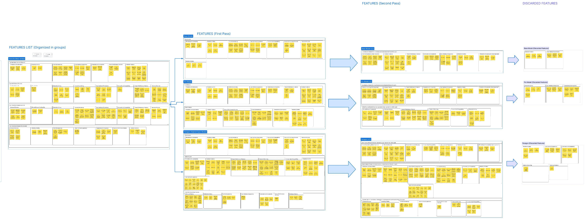 
Once we had compiled the initial list, we grouped features into categories to clarify their purpose and relationships. The groups included Control & Monitoring, Hardware Features, Power & Performance, Connectivity & Compatibility, User Interface & Experience, Reliability & Safety, Affordability & Sustainability, and Advanced Features. These categories reflected different dimensions of the product’s functionality, usability, and market positioning. For example, Control & Monitoring encompassed how users interact with the device and observe its status, while Hardware Features captured the physical and electrical build of the product. Similarly, categories like Reliability & Safety emphasized protections and standards, and Affordability & Sustainability reflected both cost and environmental considerations. 

After grouping, we applied a ranking process to evaluate which ideas were most essential to the core goals of the project. By ordering features from most to least critical, we identified a set of “Core Features” that would form the foundation of the base product model. Additional features were then layered on to define more advanced product variations. This ranking exercise allowed us to balance innovation and user comfort with practical considerations such as feasibility and cost. The structured approach ensured that our design process emphasized both creativity and pragmatism, while giving us flexibility to differentiate across product tiers. 

Through this process of meeting, documenting, grouping, and ranking, we transformed an unstructured list of ideas into an organized and prioritized set of features. The outcome provided a clear roadmap for our design iterations and ensured that our product concepts remained aligned with both user needs and project goals. Ultimately, the brainstorming sessions gave us a strong foundation for moving forward into prototyping and refinement. 

## Brainstorming Participants, Tools Used, Resources, Grouping, & Ranking 

Our brainstorming ideas grouped into categories 
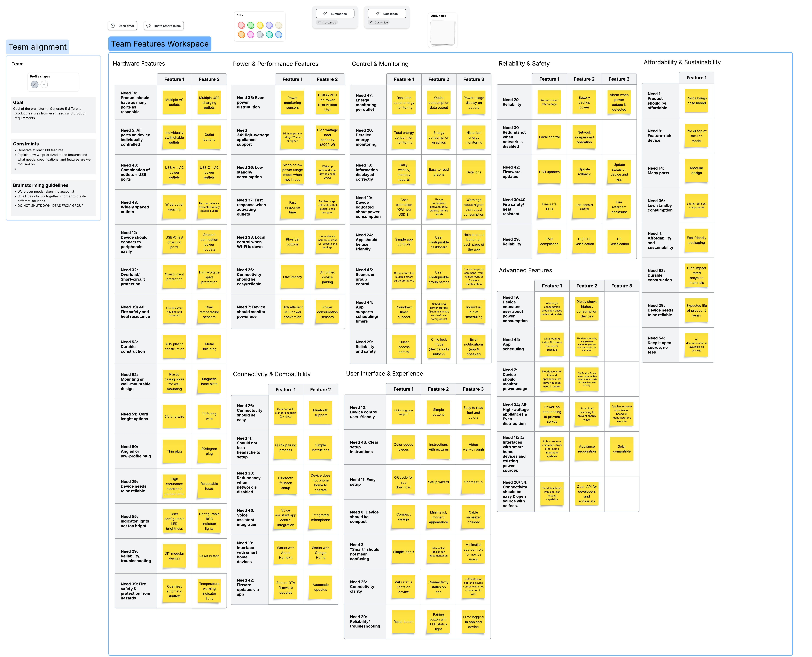 

The brainstorming ideas get ranked and get a first pass to see what stays. 
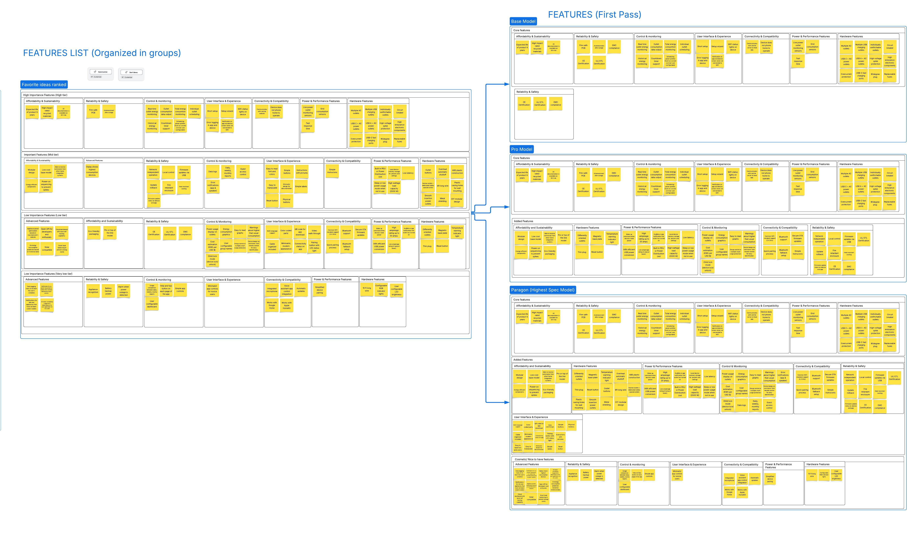 

The brainstorming ideas get ranked and get a last pass with more stipulations such as feasability and budget contraints. Removed features are placed in the discarded features boxes. 
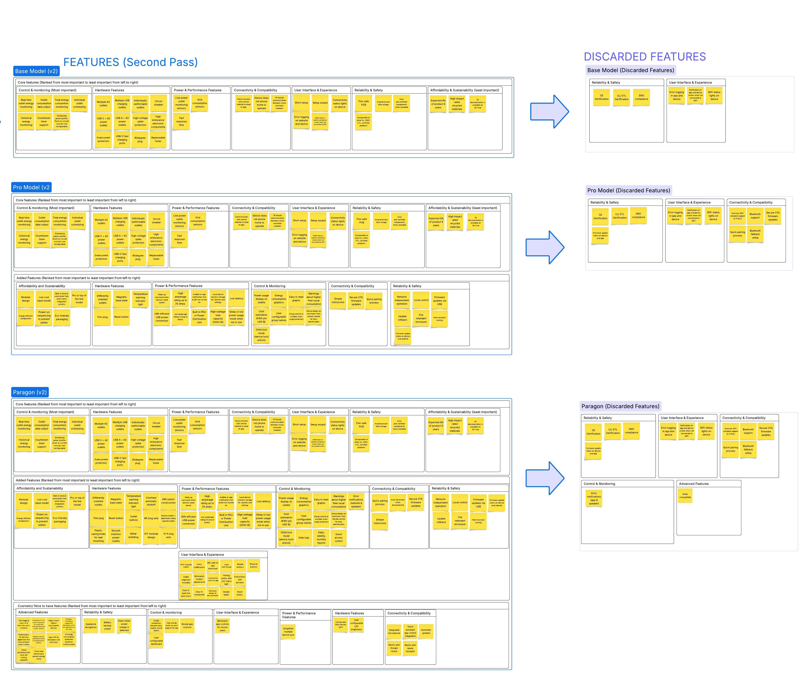 
## Our 3 Concept Designs 

### The Sparky Charging Hub  
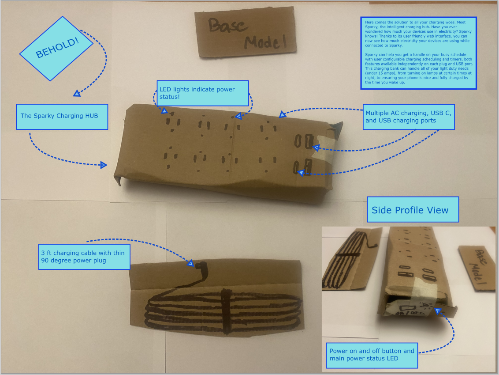     

### The Pro Model  
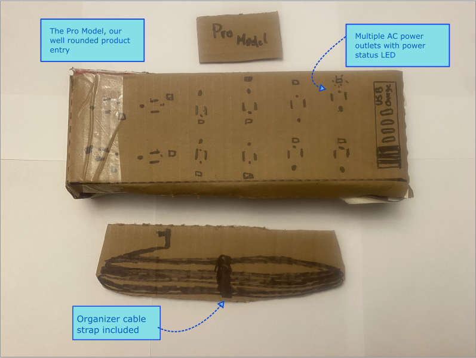   
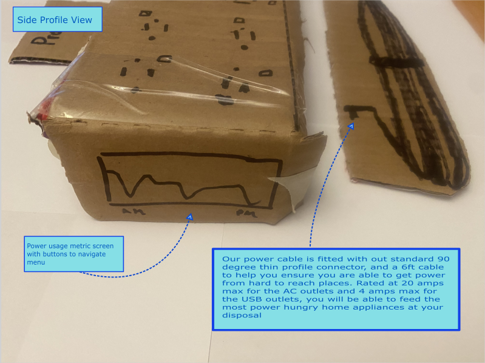   
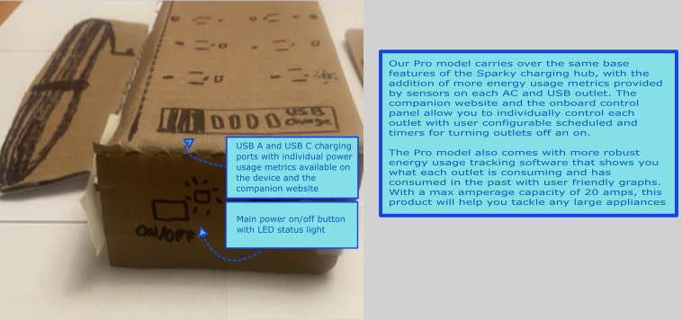    
### The Paragon Model  
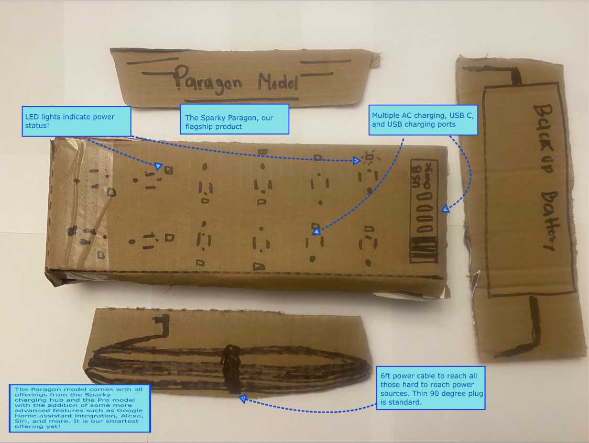   
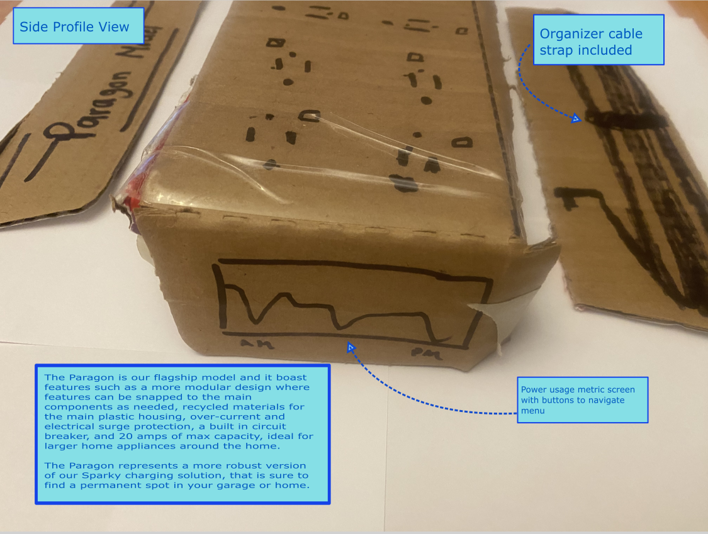   
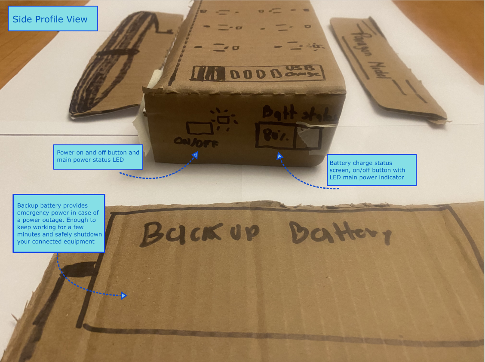   

