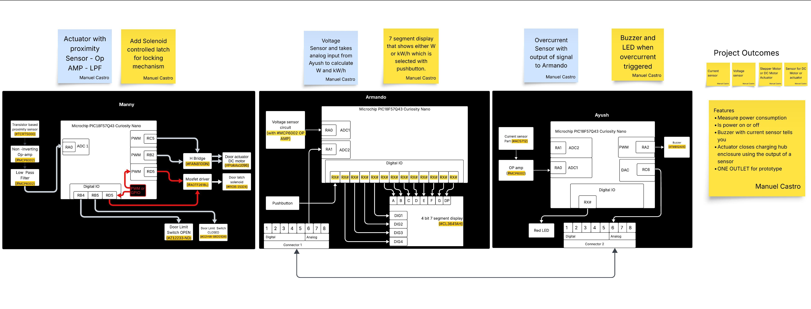
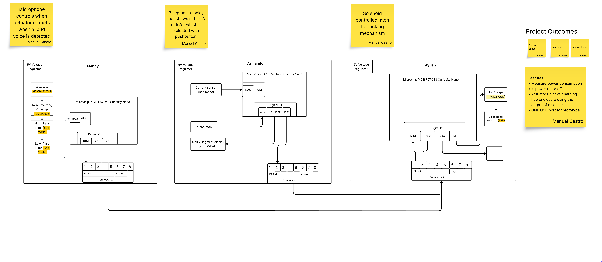
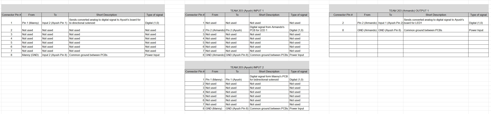

## Introduction
The team block diagram demonstrates how each PIC Curiosity Nano micocontroller will take in analog signals, filter them, and process them through specific input pins, and which pins will output to analog devices or digital pins. Finally the diagram shows how we will communicate across microcontrollers using the 8 pin ribbon connectors.  

## First Draft

The diagram shown above was our first attempt at a simplifcation of our idea into a demo where each microcontroller has at least one analog sensor or actuator with the required filters, amplifiers, or drivers.

**Notes from this iteration:** 
 1. We didn't realize our boards all needed to communicate to at least one other board. 
 2. Manny's board was initially planned to include a motor with a door latch solenoid, plus limit switches to determine when the door was open or closed. 
 3. We believed it necessary to have both a voltage sensor and a current sensor.  
 
## Latest Iteration

**Notes from this iteration:** 
1. All boards send/receive some sort of communication 
2. Functionality is simplified and aligns with updated design direction. 
3. Current sensor is all that is required to calculate power with a constant voltage. 
4. Updated microphone sensor path from Manny's individual block diagrams with details 

### Team Connectors

Attached [here](Team Connectors.xlsx) is a link to the above excel sheet we developed with further details on the 8 pin connections between subsystems shown on our latest block diagram.

## Decision making process
We structured our block diagram to accurately show the inputs and outputs of our boards and which pins and what type of communication we are using between boards.

The result of this is three separate boards each with female 8 pin connectors that are all going to be connected together. "Connector 1" represents an input connector "Connector 2" represents an output connector.

The block diagram meets the product requirements because it features the new emphasized product features including: security/safety with the solenoid and microphone, the sensor/display to show power consumption, and the fact that the entire device is contained with these components means it is not reliant on external apps, eliminating connectivity issues.