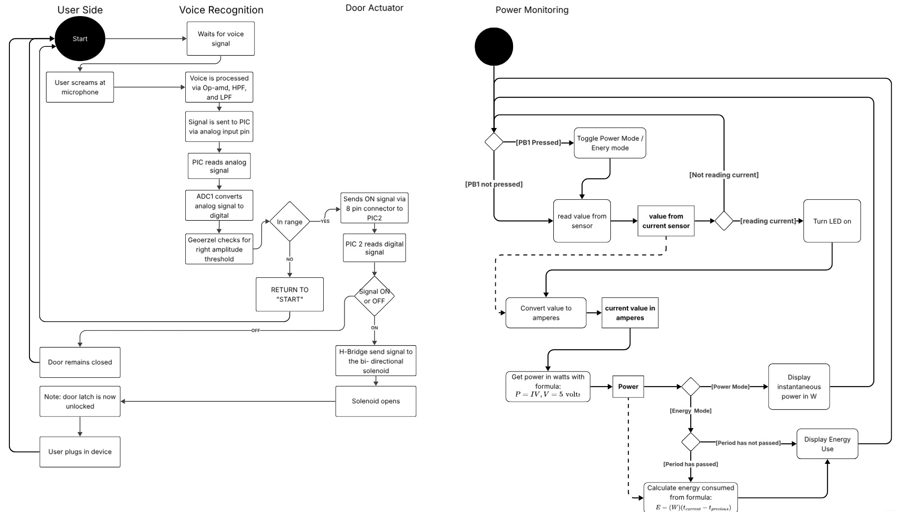
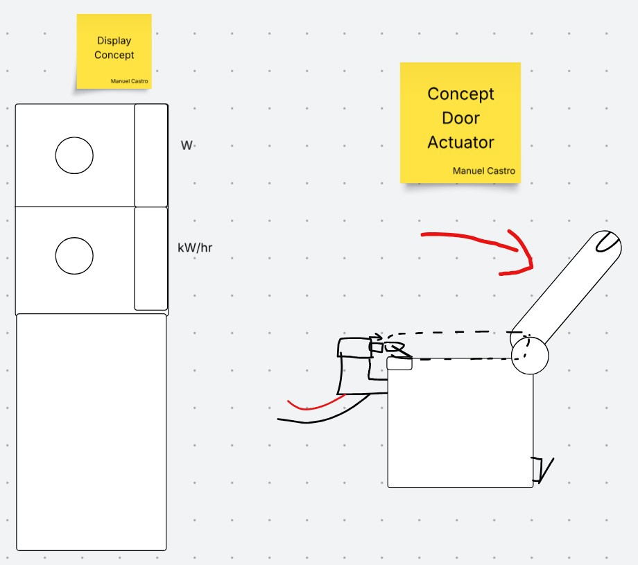
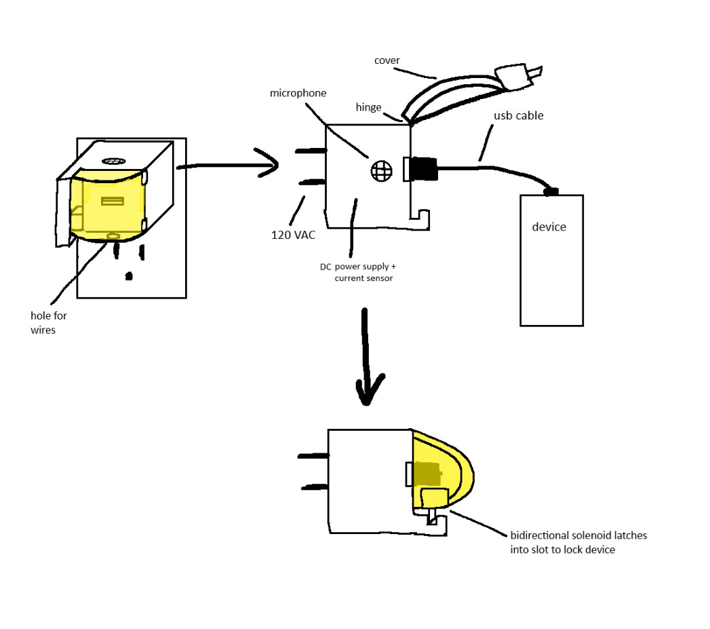

## Introduction
The intention of this section is to provide you with an overview of what our subsystem logic looks like overall, and how each individual PCB interacts and communicate with one another. Below are some questions we asked ourselves as we reseached our solutions and the sofware logic diagram that we produced.

## Research Question

* Bullet Point 1
* Bullet Point 2
* Bullet Point 3

## Software Diagram

 
**Figure 1:** Softare proposal logic diagram 

## Concept Designs ##
 
**Figure 2:** Our first concept design that was created during our first brainstorming session. 

 
**Figure 2:** After many internal discussions, our team narrowed down the next evolution of our concept to a feasable and attainable goal. 

## Results

1. Numbered Point 1
1. Numbered Point 2
1. Numbered Point 3

## Conclusions and Future Work

## External Links

Here is a link to our team's Lucid Chart diagram that was showcased on figure 1[Link to Lucid Chart Diagram](https://lucid.app/lucidspark/50a3b367-512a-4085-a351-7ba08a005a17/edit?viewport_loc=-1504%2C4113%2C4121%2C2114%2C0_0&invitationId=inv_718e862a-cc1e-4b68-8ead-81b798ccf1a2)

## Results

1. Numbered Point 1
1. Numbered Point 2
1. Numbered Point 3

## Conclusions and Future Work

## External Links

[example link to idealab](https://idealab.asu.edu)

## References

