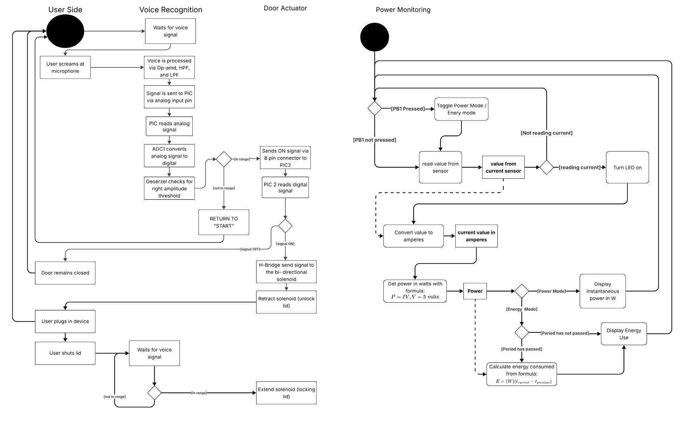

## Introduction
The intention of this section is to provide you with an overview of what our subsystem logic looks like overall, and how each individual PCB interacts and communicate with one another. Below are some questions we asked ourselves as we reseached our solutions and the sofware logic diagram that we produced.

## Research Question

1. Does our subsystem logic have an end?
2. What were the shapes for UML activity or state machine diagram?
3. What better represents our logic: activity diagram or state machine diagram?

## Software Diagram

 
**Figure 1:** Software proposal logic diagram 

## Concept Designs ##
 
**Figure 2:** Our first concept design that was created during our first brainstorming session. 

 
**Figure 2:** After many internal discussions, our team narrowed down the next evolution of our concept to a feasable and attainable goal. 

Here is a link to our team's Lucid Chart diagram that was showcased on figure 1[Link to Lucid Chart Diagram](https://lucid.app/lucidspark/50a3b367-512a-4085-a351-7ba08a005a17/edit?viewport_loc=-1504%2C4113%2C4121%2C2114%2C0_0&invitationId=inv_718e862a-cc1e-4b68-8ead-81b798ccf1a2)

## Results
1. Our logic does not have an end as it loops continuously as long as the design is being powered.
2. We successfully represented the logic with the correct shapes [1].
3. We decided an activity diagram best models our logic because our code will be instructions carried out one after another with only a few conditions that change the flow of operations, whereas a state machine model would mean each action has a condition before it [2].

## Conclusions and Future Work

## References
[1] [Activity Diagrams - Unified Modeling Language (UML)](https://www.geeksforgeeks.org/system-design/unified-modeling-language-uml-activity-diagrams/)
[2] [What is the difference between State Machine Diagram and Activity Diagram?](https://www.geeksforgeeks.org/system-design what-is-the-difference-between-state-machine-diagram-and-activity-diagram/)

